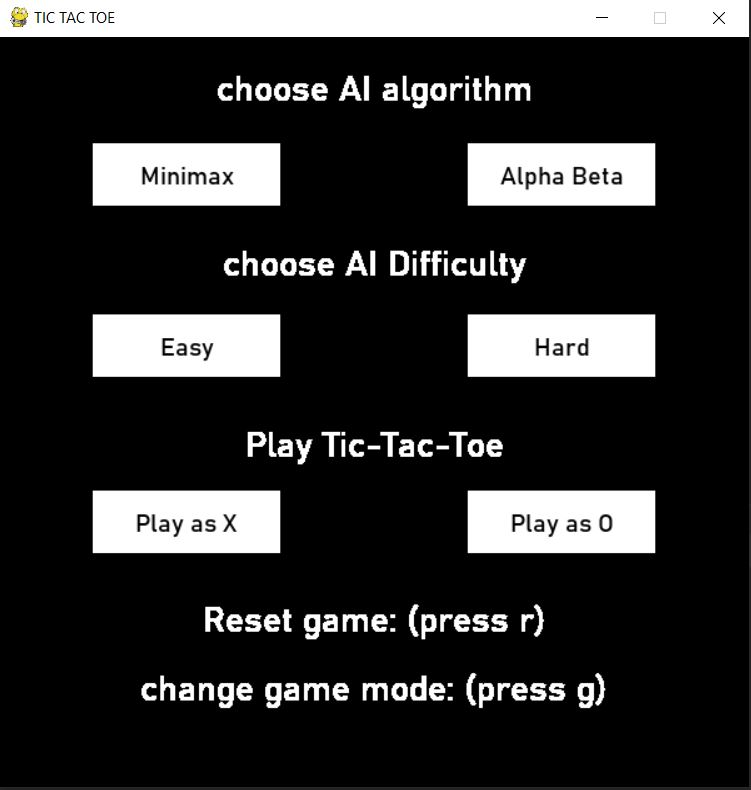
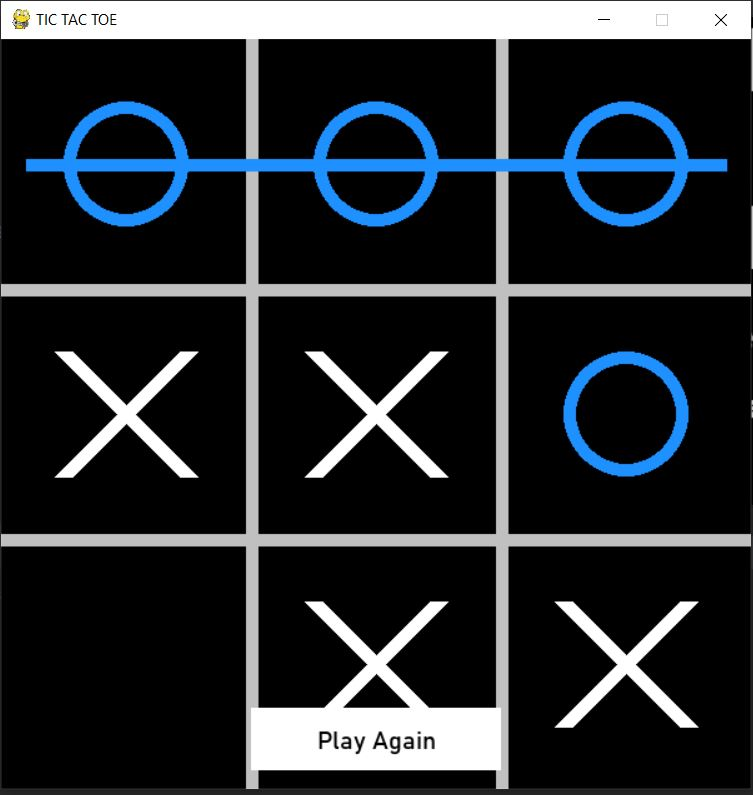

# Tic-Tac-Toe With AI
a Tic-Tac-Toe GUI application using minimax and alpha beta pruning algorithms

## packages
* Python 3.9
* Pygame

## Images
this is the home page of the game

and if a player wins

## Evaluation Function

in hard level that we go deep down to the terminals we check if we have a win or not in the board
if the X wins we return a positive value ( +1 ) if O that is minimizer wins will get
a negative value\
( -1 )

for the easy level we only go until the half of the game tree depth and return the utility function of terminals in that depth.

## Description
there are two game mode, in default AI plays with a human and in other AI plays vs AI\
( pressing g will change the game mode )

we can test that we can't beat the AI in hard level, so it will be an unbeatable tic-tac-toe

the time to decide the first move for AI is:

Minimax | 0.495434\
Alpha-Beta | 0.049923 

so clearly we can see the Alpha-Beta algorithm runs about 10x faster than the Minimax
